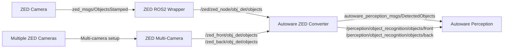

# Autoware ZED Converter

ROS2 packages for converting ZED camera object detection messages to Autoware perception format.

## Overview

This repository provides converters and launch files to integrate ZED cameras with Autoware. It transforms ZED object detection messages (`zed_msgs/msg/ObjectsStamped`) to Autoware perception messages (`autoware_perception_msgs/msg/DetectedObjects`).

## Architecture



## Prerequisites

- ROS2 (tested with Humble)
- Autoware 0.45.1 built and sourced
- ZED ROS2 packages built and sourced

## Installation

1. Clone this repository into your ROS2 workspace:
```bash
cd ~/ros2_ws/src
git clone <repository_url> autoware_zed
```

2. Build ZED dependencies first:
```bash
cd ~/ros2_ws/src/zed
make build
```

3. Build this package:
```bash
cd ~/ros2_ws/src/autoware_zed
source ../zed/install/setup.sh
make build
```

4. Source the installation:
```bash
source ~/ros2_ws/install/setup.bash
```

## Usage

### Single Camera
```bash
ros2 launch autoware_zed_launch single_camera_example.launch.xml
```

### Multi-Camera
```bash
ros2 launch autoware_zed_launch multi_camera_example.launch.xml
```

### Converter Node Only
```bash
ros2 launch autoware_zed_converter converter_node.launch.xml \
  input_topic:=/zed/zed_node/obj_det/objects \
  output_topic:=/perception/object_recognition/objects
```

## Packages

- **autoware_zed_converter**: Core converter node that transforms ZED messages to Autoware format
- **autoware_zed_launch**: Example launch files for single and multi-camera setups
- **zed_launch**: Launch files for ZED cameras with object detection

## Configuration

Key parameters for the converter node:
- `input_topic`: ZED objects topic
- `output_topic`: Autoware objects topic  
- `use_tracking_velocity`: Enable velocity from ZED tracking (default: true)
- `existence_probability_threshold`: Minimum confidence threshold (default: 0.5)

## Object Classification Mapping

| ZED Label | Autoware Label |
|-----------|----------------|
| PERSON | PEDESTRIAN |
| VEHICLE/CAR | CAR |
| TRUCK | TRUCK |
| BUS | BUS |
| BICYCLE | BICYCLE |
| MOTORCYCLE | MOTORCYCLE |
| Others | UNKNOWN |

## License

Apache-2.0